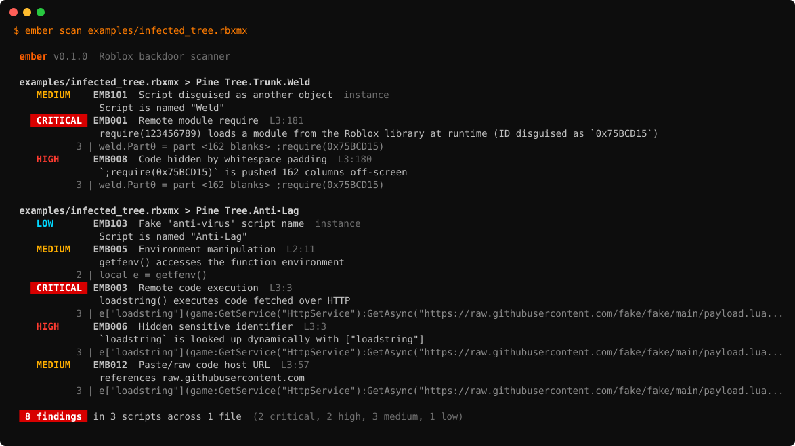

<h1 align="center">Ember</h1>

<p align="center">
  <b>Find backdoors in Roblox free models before they find your players.</b><br>
  Scans <code>.rbxm</code>, <code>.rbxmx</code>, <code>.rbxl</code>, <code>.rbxlx</code>, <code>.lua</code> and <code>.luau</code> files. No Roblox Studio needed.
</p>

<p align="center">
  <a href="#install"></a>
  <a href="#rules"></a>
  
  <a href="LICENSE"></a>
</p>

<p align="center">
  
</p>

---

## Why

Every Roblox developer has grabbed a tree, a car or an admin panel from the Toolbox. Some of those models carry a
hidden script that quietly runs `require(123456789)`: a module the attacker can update at any time, which gives them
full control of your server. The script is usually named `Weld`, pushed 200 columns off-screen, or spelled out with
`string.char` so a text search will not find it.

Ember opens the model file directly, pulls out every `Script`, `LocalScript` and `ModuleScript`, and runs each one
through a Luau-aware analyzer that sees through those tricks:

```lua
weld.Part0 = part                                                            ;require(0x75BCD15)   -- EMB001 + EMB008
local run = getfenv()[string.char(108,111,97,100,115,116,114,105,110,103)]    -- EMB005 + EMB006 ("loadstring")
local http = game:GetService(("ecivreSpttH"):reverse())                       -- EMB006 ("HttpService")
local id = 0x75BCD15 - 1; pcall(require, id)                                   -- EMB001 (constant folded)
```

## Install

```bash
pip install "git+https://github.com/tygovansteenpaalwork-gif/Projects#subdirectory=ember"
```

Newer place files use ZSTD compression. For those, add the optional extra:

```bash
pip install "ember-scan[zstd] @ git+https://github.com/tygovansteenpaalwork-gif/Projects#subdirectory=ember"
```

## Usage

```bash
ember scan MyModel.rbxm                 # one model
ember scan ~/Downloads                  # every Roblox/Luau file in a folder
ember scan src --format json            # machine-readable output
ember scan . --format sarif -o ember.sarif
ember scan . --min-severity medium      # hide low-severity notes
ember scan . --fail-on critical         # exit code 1 only for critical findings
ember rules                             # list every rule
```

Exit code is `1` when a finding at or above `--fail-on` (default `high`) is found, so Ember drops straight into CI.

### GitHub Action

Scan a Rojo project on every push and show the results in the repository's **Security** tab:

```yaml
name: Ember
on: [push, pull_request]

permissions:
  contents: read
  security-events: write

jobs:
  scan:
    runs-on: ubuntu-latest
    steps:
      - uses: actions/checkout@v4
      - uses: tygovansteenpaalwork-gif/Projects/ember@main
        with:
          path: src
          fail-on: high
```

| Input | Default | Description |
|---|---|---|
| `path` | `.` | Files or folders to scan (space separated) |
| `fail-on` | `high` | Fail the job at this severity, or `none` |
| `upload-sarif` | `true` | Upload results to GitHub code scanning |

### As a library

```python
from ember import scan_paths, scan_source

for finding in scan_source('require(123456789)'):
    print(finding.rule.id, finding.severity.label, finding.message)

result = scan_paths(["MyGame.rbxl"])
print(result.units, "scripts,", len(result.findings), "findings")
```

## Rules

| ID | Severity | Detects |
|---|---|---|
| `EMB001` | critical | `require(<asset id>)`, including IDs hidden in hex, arithmetic, `tonumber("...")`, variables and `pcall(require, id)` |
| `EMB002` | high | `InsertService:LoadAsset(<id>)` pulling a model at runtime |
| `EMB003` | critical | `loadstring` in a script that also makes HTTP requests (download and execute) |
| `EMB004` | high | `loadstring` on its own |
| `EMB005` | medium | `getfenv` / `setfenv`; high when used as `getfenv()[...]` or `getfenv().require` |
| `EMB006` | high | `require`, `loadstring`, `HttpService`, ... spelled with `string.char`, `\ddd` escapes, `:reverse()`, `"req".."uire"` or `["require"]` |
| `EMB007` | medium | Long strings written as character codes or escapes, shown decoded |
| `EMB008` | high | Code pushed off-screen by whitespace padding |
| `EMB009` | medium | Obfuscated blobs: bytecode tables, escape walls, `IlIl1l` identifiers, high-entropy lines |
| `EMB010` | high | Obfuscator signatures (Luraph, IronBrew, MoonSec, PSU, ...) |
| `EMB011` | high | Discord webhook URLs, including split or encoded ones |
| `EMB012` | medium | Paste/raw hosts used to serve payloads (pastebin, raw.githubusercontent, ...) |
| `EMB101` | medium | Script named like another object (`Weld`, `Mesh`, `ThumbnailCamera`, ...) |
| `EMB102` | medium | Script with an empty or invisible name |
| `EMB103` | low | Script named like a fake "anti-virus" / "anti-lag" |

### Suppressing a finding

```lua
local fn = loadstring(source) -- ember-ignore EMB004
-- ember-ignore-file          (in the first 10 lines: skip the whole script)
```

## How it works

1. **File readers.** The binary format (`<roblox!` header, LZ4/ZSTD chunks, interleaved referent arrays) is parsed
   in pure Python, including a from-scratch LZ4 block decoder. XML models are read with DTDs and entities refused, so a
   hostile file cannot trigger entity expansion.
2. **Tokenizer.** A forgiving Luau lexer that decodes every string form (`\ddd`, `\xHH`, `\u{...}`, `\z`, long
   brackets) and never gives up on malformed input.
3. **Recovery.** Strings built with `string.char`, `:reverse()` and `..` are reconstructed, and numeric expressions
   are constant-folded, so disguised values are compared in their real form.
4. **Rules.** Each rule is a small function over tokens and recovered strings, with JSON and SARIF 2.1.0 output.

Tested against roughly 2,800 scripts from Roact, Rodux, Knit, Cmdr, Fusion, Nevermore and jest-roblox with **zero
critical findings**. The remaining notes point at real `loadstring` and `setfenv` use in test runners and plugins,
which is exactly what Ember should surface.

## Limits

Ember is static analysis. It cannot see what a required module does after it is downloaded, and heavily obfuscated
code is flagged as obfuscated rather than decoded. A clean result means none of the known techniques were found, not
that a model is guaranteed safe. When in doubt, do not publish a game with a script you cannot read.

## Development

```bash
cd ember
pip install -e ".[dev]"
pytest
python scripts/render_demo.py > docs/demo.svg   # regenerate the README image
```

## License

MIT
